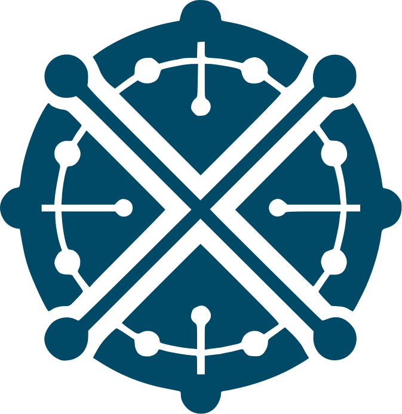

  <a href="https://github.com/deltaDAO/microservice-pontusx-monitor/tree/main">
      <picture>
        <source media="(prefers-color-scheme: dark)" srcset="assets/pontusx_logo_blue.svg">
        
      </picture>
  </a>

<h1 style="font-size: 40px;" align="center">Pontus-X</h1>

   Powering European Data Spaces

  

Pontus-X is a decentralized digital ecosystem that aims to enable secure, compliant, and innovative data sharing and monetization across Europe within the Gaia-X framework.

## Vision
Our vision is to be Europe's premier decentralized digital ecosystem, facilitating seamless collaboration and innovation across diverse industries. We envision a future where organizations can securely exchange and monetize their data, driving economic growth and digital transformation while maintaining control over their data.

## Mission
Enable secure, decentralized, and compliant data sharing and digital service monetization across Europe. We aim to empower organizations with cutting-edge infrastructure that enables data sovereignty and privacy through innovative paradigms like Compute-to-Data (CtD). Pontus-X is committed to fostering a sustainable and competitive ecosystem for digital services within the Gaia-X framework, promoting trust and transparency in the digital economy.

## Core Values
- **Data Sovereignty**: Upholding the highest data protection and privacy standards ensures organizations maintain complete control over their data.
- **Transparency**: Promoting openness and accountability in all ecosystem digital transactions and governance processes.
- **Innovation**: Encouraging continuous development and integration of cutting-edge technologies to drive digital transformation and economic growth.
- **Collaboration**: Fostering a cooperative environment where participants can freely share knowledge, resources, and services to achieve common goals.
- **Security**: Implementing robust mechanisms to protect data and ensure secure digital interactions across the ecosystem.
- **Sustainability**: Supporting environmentally and economically sustainable business practices through efficient and decentralized technologies.
- **Compliance**: Adhering to European regulations and the Gaia-X Trust Framework to meet legal and ethical standards.
